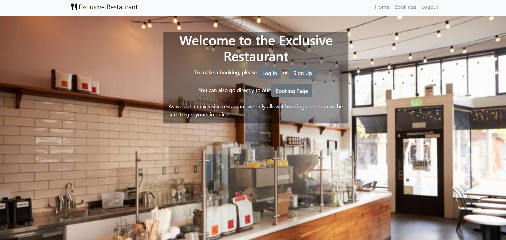
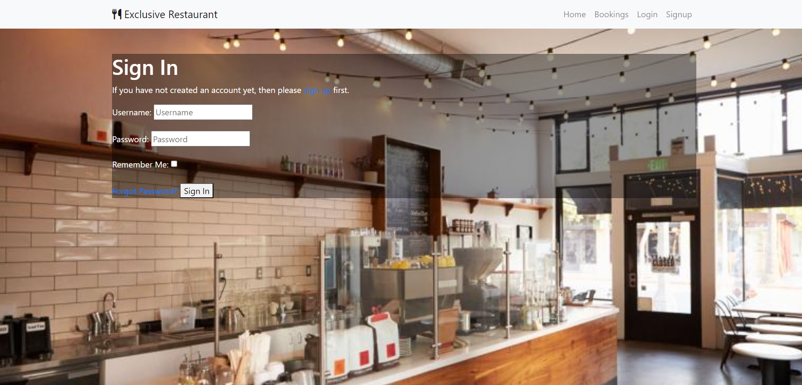
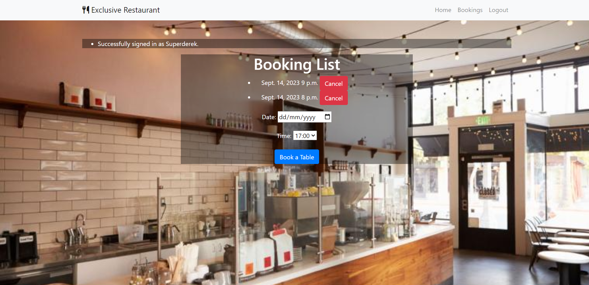
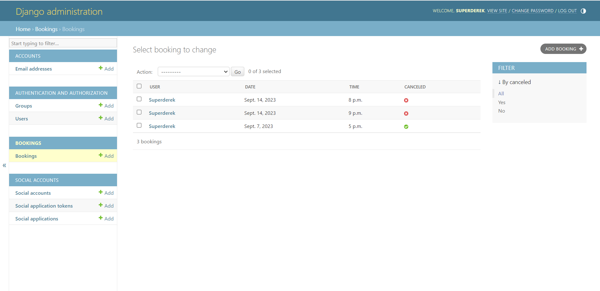
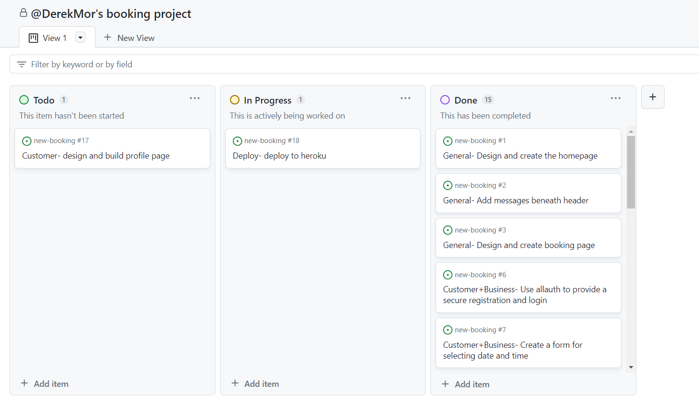

# Exclusive Restaurant

Exclusive Restaurant is a web application that allows users to make restaurant bookings. It is built using various technologies and frameworks and deployed using Heroku, Cloudinary and ElephantSQL, a description of all these is provided below. Here is a link to the deployed website. \
**Note:** This booking system would not be a whole restaurants website but only the booking system feature for one. This app has full functionality for authentication and creating bookings but is only a basic app and should be included in and styled to suit a full restaurant website. The current version has very little CSS and is mainly styled with Bootstrap classes to allow custom classes to be added to elements when integrating into a larger project.

## Technologies and Frameworks Used

- **Django**: A high-level Python web framework.
- **HTML/CSS**: For building the website's front-end.
- **JavaScript**: For adding interactivity to the front-end.
- **Bootstrap**: A front-end framework for responsive web design.
- **Python**: The primary programming language used in the back-end.
- **PostgreSQL**: A powerful, open-source relational database.
- **Heroku**: A cloud platform for deploying web applications.
- **ElephantSQL**: A PostgreSQL database hosting service.
- **Cloudinary**: A cloud-based image and video management service.
- **Allauth**: A Django package for user authentication and registration.

## Features

- **Main Homepage**: The main landing page provides an introduction to the restaurant and its booking service.\

- **User Authentication**: Users can create accounts and log in using the Allauth package.

- **Booking Page**: Users can select dates and times to make restaurant bookings.
- **Messages Section**: Below the header there is a messages section where users are informed of actions they take. Login, logout successful bookings and cancelations are shown here.
- **Bookings List**: Above the booking form a list of any bookings a user has made is shown here with the option to cancel the booking.

- **Admin Panel**: Admins can access an admin panel to create and cancel bookings for users.

## Features Not Implemented

- **Select Box Improvement**: The select box for time slots currently doesn't show booked-up time slots, which could be a useful improvement. I did try to implement this using both javascipt and modifying the view but kept causing bugs so it was removed.

- **User Profile Page**: A user profile page to allow users to amend their bookings without canceling and rebooking.

## Testing

The website has undergone thorough testing, including:

- Manual testing of user signups and logins.
- Manual testing of booking creation and cancellation.
- Cross-browser and cross-device testing for responsiveness.
- Code checkers were not used on all files as the settings file show many errors but work fine but all template files, views and urls pass.

## Bugs
- Main bug fixed was being able to book a table for a date in the past which i tried many solutions which usually broke the code further. I was trying to use the date time class to pass a datetime to my form but no matter what i tried from anywhere i could find I was getting errors about it adding on seconds to the time the my form/model wasnt expecting. I ended up defining a custom list of time choices in my forms.py file to solve this issue. Some of the previous code still remains in the views.py file that I would like to make work in the future.
- In the features not impemented section above I noted not showing the select option for a time if it is fully booked. At the moment a user can still try to book a fully booked slot but a message saying the slot is fully booked will show in messages. I thought i was close with this one but eventually ran out of time. The code I added checked times but if a slot was booked for a certain time on any day it would remove that slot from every day instead of just the day that was fully booked. 

## Agile

### User Stories for Customers

1. As a customer, I want to create an account and log in securely to access the booking functionality.

2. As a customer, I want to select my preferred date and time for a restaurant booking.

3. As a customer, I want to receive confirmation and notification messages after successfully making a booking.

4. As a customer, I want the ability to cancel my booking if my plans change.

### User Stories for the Business

1. As the business owner, I want a secure authentication system to manage customer accounts.

2. As the business owner, I want a booking system that allows customers to reserve tables for specific dates and times.

3. As the business owner, I want to have access to an admin panel to create and cancel bookings on behalf of customers.

### Task list

1. Task list is a project part of the repository

## Deployment

The website is deployed on Heroku with the PostgreSQL database hosted on ElephantSQL. Cloudinary is used for image management.

To deploy the website:

1. Create a Heroku app.
2. Set up the PostgreSQL database on ElephantSQL.
3. Configure Cloudinary for image management.
4. Push the code to Heroku using Git.

## Credits
- Having created an e-commerce site before this one I was able to borrow some features from that one for this. <a href="https://github.com/DerekMor/legends_gym"> Link to the GitHub repo.</a> From this I used the messages section almost exactly and I also repurposed the shopping cart summary that listed the items in a shopping cart for this project as the booking list, almost the same but looped through a users booking and listed them with the ability to cancel them.
- Bootstraps documentation is also incredibly helpful
- Stackoverflow for ideas on solving my datetime error
- CodeInstitute Django Deployment Instrucions Google Drive file